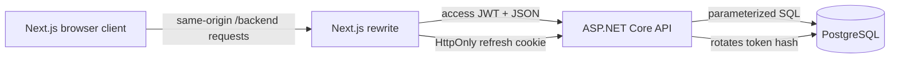

# Boardsync

Boardsync is a full-stack Kanban application built with Next.js, ASP.NET Core,
Dapper, and PostgreSQL. It demonstrates secure SPA authentication, resource
board membership, transactional fractional ordering, and a production-oriented
deployment boundary.

## Current showcase scope

- Register, log in, restore a session, and log out.
- Create boards and see owned or shared boards in the left navigation.
- Add registered users to a board and assign tickets to its members.
- Create, reorder, and delete columns.
- Create, edit, move, reorder, and delete cards.
- Discuss tickets with comments, emoji reactions, and HTTP(S) attachment links.
- Keep nonmembers out of boards; reserve board rename/delete for the owner.
- Return consistent API success and error envelopes.



The access token stays in browser memory, limiting its lifetime if JavaScript is
compromised. The refresh token is an opaque value in a secure HttpOnly cookie;
only its SHA-256 hash is stored in PostgreSQL. Every protected handler derives
the user ID from the validated JWT instead of trusting an ID supplied by the
client.

## Run locally

Requirements: .NET 10 SDK, Node.js 24, npm, and PostgreSQL.

1. Configure backend secrets:

   ```powershell
   dotnet user-secrets set --project Boardsync.Api "ConnectionStrings:DefaultConnection" "Host=localhost;Port=5432;Database=boardsync;Username=postgres;Password=YOUR_PASSWORD"
   dotnet user-secrets set --project Boardsync.Api "Jwt:SigningKey" "A_RANDOM_SECRET_WITH_AT_LEAST_32_BYTES"
   ```

2. Start the API:

   ```powershell
   dotnet run --project Boardsync.Api --launch-profile http
   ```

3. Create `boardsync-web/.env.local`:

   ```text
   NEXT_PUBLIC_API_URL=http://localhost:5230
   ```

4. Start the frontend in another terminal:

   ```powershell
   cd boardsync-web
   npm ci
   npm run dev
   ```

Open `http://localhost:3000` and register a new account. Restart an already-running
API after updating the source: DbUp applies pending migrations at startup.

## Verify

```powershell
dotnet build Boardsync.Api/Boardsync.Api.csproj --no-restore
dotnet test Boardsync.Api.Tests/Boardsync.Api.Tests.csproj --no-restore
cd boardsync-web
npm run lint
npm test
npm run build
```

See the [feature review and test walkthrough](docs/feature-review.md),
[deployment](docs/deployment.md), [production decisions](docs/production-decisions.md),
and [verified project state](docs/project-state.md) for the release evidence,
design reasoning, and remaining hosting steps.
