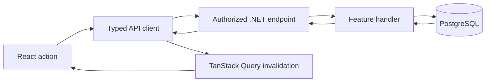

# Boardsync feature review and acceptance guide

This walkthrough covers secure Kanban boards and the first collaboration
increment. It records what the code is responsible for, why each boundary
exists, and what to verify in the browser. Uploaded files, theme switching,
and real-time updates remain later product work.

## How a change travels

The endpoint binds HTTP data, validates it, and identifies the signed-in user.
The handler makes the database decision. PostgreSQL enforces relationships and
transactions. After a successful write, the frontend refetches the affected
board so its display reflects persisted state.

## Feature decisions and evidence

| Feature | Decision to understand | Evidence as of 2026-10-01 |
| --- | --- | --- |
| Register | Normalize email, hash the password, and rely on a unique email constraint to handle concurrent signups. | HTTP 201; duplicate normalized email 409. |
| Login and current user | Issue a short-lived signed JWT; obtain identity from its validated `sub` claim. | Login and `/api/auth/me` returned 200. |
| Session refresh and logout | Store only a hash of the opaque refresh token in PostgreSQL; rotate on refresh and revoke on logout. | Refresh returned 200; refresh after logout returned 401. |
| Membership | Owner adds a registered account; SQL checks member access and revokes it on removal. | Two-account HTTP smoke: 404 before invite, 200 after, 404 after removal. |
| Ownership | Keep rename/delete and membership changes owner-only; permit current members to work on the board. | Member rename returned 404; owner delete returned 204. |
| Board dashboard/sidebar | Fetch owned and shared boards with one query key and highlight the selected board. | API list returned the shared board; frontend build/lint pass. Sidebar needs browser inspection. |
| Board create, rename, delete | Keep board identity stable when renaming; delete dependent columns/cards through database cascades. | HTTP 201, 200, 204; readback confirmed rename and deletion. |
| Board detail | Return ordered columns with nested `cards: []` for an empty column. | HTTP 200 readback confirmed names, order, and card content. |
| Column create, reorder, delete | Lock the parent board during position changes; send neighbor IDs rather than client-calculated numbers. | HTTP 201, 200, 204; ordered board readback confirmed reordering. |
| Card create, edit, delete | Lock the parent column during append; keep content edits separate from movement. | HTTP 201, 200, 204; edited content appeared in board readback. |
| Assignee | Accept only owner/current member; show the name on the card and ticket detail. | Assign returned 200; board readback showed member name; removal cleared assignment. |
| Ticket activity | Persist comments with author/time and toggle per-user emoji reactions. | Live create/read/toggle passed; unsupported reaction and blank comment returned 400. |
| Attachments | Store labeled HTTP(S) links rather than uploaded bytes. | Live add/read/delete passed; `javascript:` URL returned 400. |
| Card movement | Validate adjacent destination neighbors and board scope, then calculate a fractional position in a transaction. | Empty-column and occupied-column moves returned 200; missing neighbors returned 400. |
| Ordering precision | Reject a position when `double` rounding cannot place it strictly between neighbors. | Two focused xUnit boundary tests pass. Position normalization remains future work. |
| Error and response behavior | Use a consistent JSON envelope and status codes; include a correlation ID in responses. | 29-check HTTP smoke covered success, 400, 401, 404, 409, 204, and headers. Varying `X-Forwarded-For` did not bypass the login limiter: the eleventh request returned 429. |
| Frontend state | TanStack Query caches reads; mutations invalidate the exact board key after success. | Browser CRUD flows previously reported working; six ordering-helper tests pass. |
| Logout failure | Keep the local session and show a retryable error if the API cannot revoke the cookie. | Frontend lint/build pass; the failed-network browser interaction remains on the manual checklist. |
| Production boundary | Vercel proxies `/backend/*` to Render so the refresh cookie remains same-origin; Render builds the .NET Docker image remotely. | Local proxy refresh worked; public Render/Vercel deployment remains unverified. |

The local .NET 10 Release build has zero warnings, all 14 backend tests pass, and
the Next.js production build, lint, and six frontend tests pass. The latest API
smoke used disposable accounts and removed their records afterward. The new
collaboration routes also passed a two-account live smoke. These checks do not
prove the hosted Docker image or every browser interaction.

## Browser acceptance walkthrough

Run the API and frontend using the commands in the root README, then open
`http://localhost:3000`. Use a fresh test email that you control.

1. Register and confirm the dashboard shows your display name. Refresh the page;
   the session should restore without another login. Log out and confirm the login
   page appears. Log back in. To test a failure, temporarily disconnect the API,
   click Log out, and confirm the dashboard shows an error while you remain signed
   in; reconnect the API and retry.
2. Create a board, rename it, and open it. Refresh to confirm the new name
   persisted. Check the empty-board message.
3. Create **To do**, **In progress**, and **Done** columns. Drag one column to a
   new position; refresh and confirm the order persists.
4. Add two cards to **To do**. Edit one title and description. Refresh and confirm
   both cards and the edited text persisted.
5. Drag a card above the other in **To do**, then into empty **In progress**.
   While hovering over another column, confirm a floating ticket follows the
   pointer and a dashed slot shows the destination before release. Cancel one
   drag to confirm nothing moves. Refresh after a completed move and confirm
   the same order and destination return.
6. Delete one card, then delete an empty column. Refresh to confirm both are gone.
7. Create a second account. Paste the first account's board URL while signed in
   as the second account; the API should return 404 and the UI should not reveal
   that board's contents.
8. Try a narrow browser viewport. Verify horizontal board scrolling, readable
   card text, and dialogs that fit on screen. Check loading, empty, and error
   messages by temporarily making the API unavailable and reloading.
9. Switch back to the first account. On its board, open **Members** and add the
   second account by email. Sign in as the second account and refresh:
   the shared board should appear in the left panel. Open it; member controls
   should appear, while board rename/delete controls should not.
10. Create a card, select **Details & comments**, and assign it to the second account.
    Post a comment, toggle a reaction on and off, and add an HTTPS attachment
    link. Refresh and confirm the assignee badge, comment, reaction count, and
    link persist. Remove the link and confirm it disappears.
11. As the owner, remove the second account. Confirm its assigned card becomes
    unassigned. Refresh the second account: the board should leave the sidebar,
    and its old URL should return 404. Delete the board as owner and confirm it
    disappears from the dashboard.

On the hosted deployment, repeat registration, board/card creation, movement,
page refresh, logout, login, and second-account ownership. Check `/health` and
Render logs if a request fails. See `deployment.md` for the hosting sequence.

## Explain-back checkpoints

- Why does the API read the owner ID from the JWT instead of accepting it in a
  request body?
- Why do drag requests send neighbor IDs while the database stores positions?
- What does the parent-row lock protect when two requests reorder at once?
- Why does the frontend refetch a board after a successful mutation?
- Why is assignment restricted to the board's owner and members?
- What does a passing build prove, and what requires a live HTTP or browser test?
